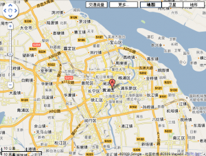
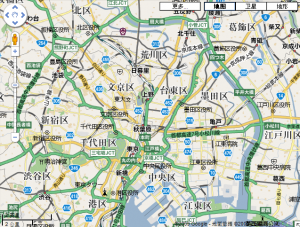

# 谷歌地图改版

- date: 2009-05-19

--------------------------

其实是我小题大做了，因为好久没上谷歌地图了，前几天打开后发现样子变了，以为是换了套数据，但一看下方还是mapabc，看来只是改了配色方案。这次修改并没有涉及Google Map，之前Google Map已经将中国的数据加入其中，可以通过[http://maps.google.com/](http://maps.google.com/)直接查看中国的数据，但这次配色方案的修改并没有替换Google Map中的数据，看来只是谷歌的一次尝试。

在这次配色方案修改中，从肉眼看漂亮了很多，总体来说非常柔和，不会让用户感到楞楞角角。

不同的单位，如区县和镇，拥有不同的字体大小以及深度，而不是选用不用的颜色。图中的静安区、闸北区相交虹口体育场来的更醒目，这样更具层次感。

淡化了底层的道路，强调高速道路以及一级道路，使整体感觉不是那么复杂，易于抓住本级突显的重点。

醒目标记了国道和省道，通过不同颜色标记了不同的地铁，更容易寻找这些交通设施。

整体来说就是一个字，“淡”，比那些刺激我眼球的颜色，我更愿意看着这张图。其实我感觉这种配色更像日本地图的配色，数据量大且不乱，颜色柔和适于长时间查看（当然不要长时间盯着屏幕）。

如果想对比可以分别打开[http://ditu.google.cn/maps](http://ditu.google.cn/maps)和[http://maps.google.com/](http://maps.google.com/)。
